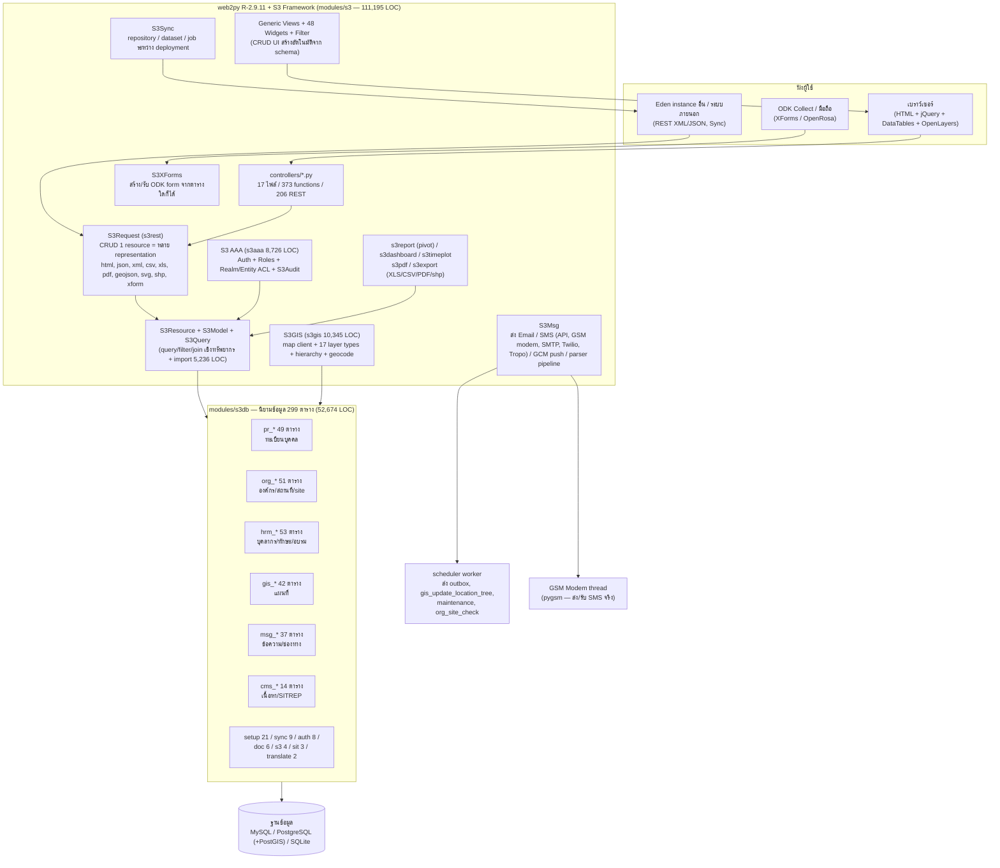
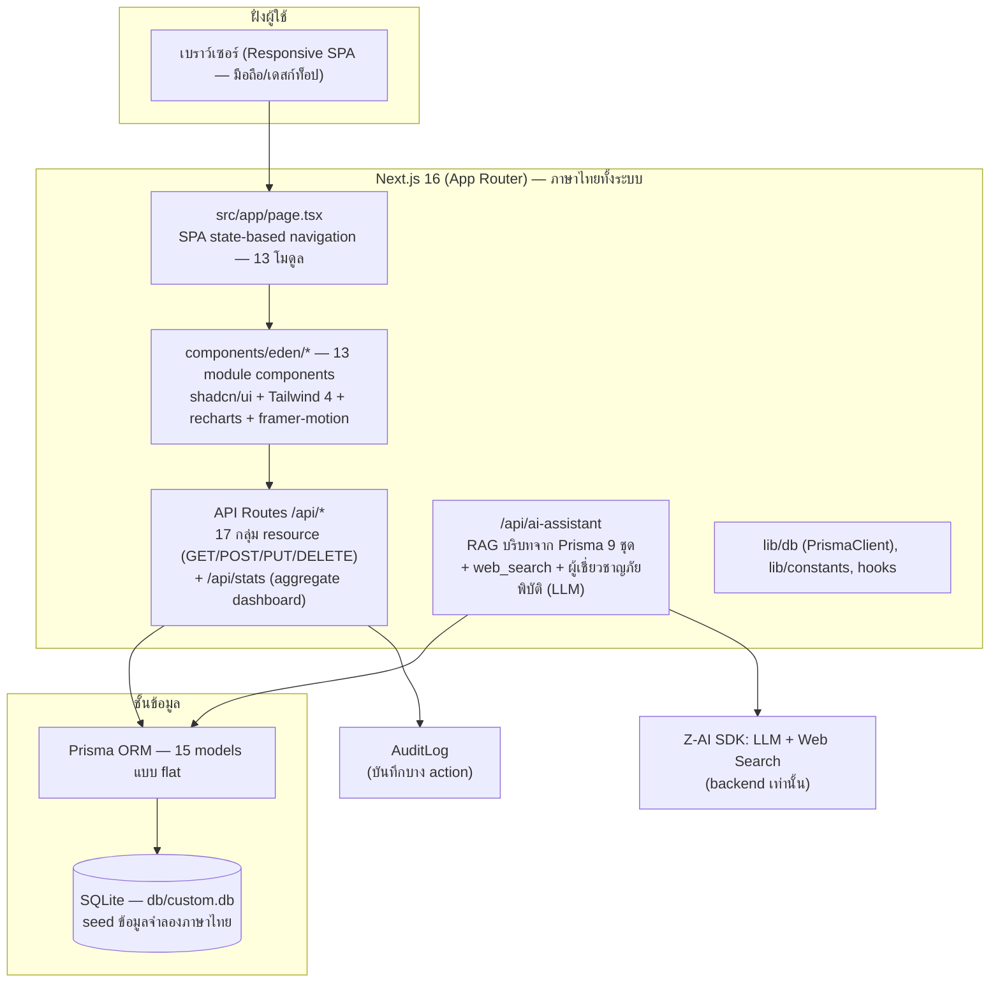

# เอกสารเปรียบเทียบสถาปัตยกรรม — Sahana Eden (eden-core) vs EDEN DMS (ฉบับใหม่)

> วัตถุประสงค์: ตรวจสอบ**ความครบถ้วนของโมดูล**และ**ความละเอียดของข้อมูล (data granularity)** ระหว่างระบบต้นฉบับกับระบบที่พัฒนาใหม่ เพื่อใช้ประกอบการตัดสินใจยกระดับการออกแบบให้มีประสิทธิภาพสูงสุด
>
> เอกสารนี้อ้างอิง **source จริงทั้งสองฝั่ง**: eden-core `VERSION nursix-dev-5066-g6620ed10d` (2021-08-28) จากไฟล์ที่อัปโหลด (แตกไฟล์ที่ `upload/eden-core-full/eden-core-master/`) และโค้ด EDEN DMS ใน repo นี้ (`prisma/schema.prisma`, `src/`)
> บันทึกการสำรวจอยู่ใน `worklog.md` Task 17-a / 17-b

---

## 1. บทสรุปผู้บริหาร (Executive Summary)

| มิติ | eden-core (ต้นฉบับ) | EDEN DMS (ใหม่) | ประเมิน |
|---|---|---|---|
| กรอบงาน | web2py + S3 framework (Python 2/3) รวม 111,195 LOC เฉพาะ framework | Next.js 16 App Router + TypeScript + Prisma | ใหม่ = stack สมัยใหม่ ดูแลง่ายกว่ามาก |
| โมดูล (controller) | 17 controllers, **373 endpoints** (206 เป็น REST) | 13 โมดูล UI, **17 กลุ่ม API** + AI Assistant | ใหม่ครอบคลุม "เส้นทางหลัก" ของงาน DMS |
| ตารางข้อมูล | **299 ตาราง** ใน modules/s3db + 13 meta fields ทุกตาราง | **15 models** แบบ flat | ใหม่เบากว่าราว 20 เท่า — ครอบคลุมเฉพาะ core workflow |
| กลไกสถาปัตยกรรม | super-entity, component tables, soft-delete+uuid+ownership, realm ACL | ไม่มีกลไกเหล่านี้ | **ช่องว่างเชิงโครงสร้างที่ต้องตัดสินใจ** (ดู §7–8) |
| สิ่งที่ใหม่มีแล้วต้นฉบับไม่มี | — | Dashboard data-viz, AI Assistant (RAG+web search), Shelter/Inventory/Requests ในตัว | จุดแข็งของฉบับใหม่ |
| ภาษาไทย | th.py 6,603 คำแปล (ใหญ่อันดับ 3 ของโปรเจกต์) | ทั้งระบบเป็นภาษาไทยแท้ (hardcoded) | ใหม่เหมาะกับผู้ใช้ไทย แต่ lock-in ภาษาเดียว |

**ข้อสรุปสั้น:** EDEN DMS ฉบับใหม่ครอบคลุม workflow หลักของงานจัดการภัยพิบัติ (เหตุการณ์ → ผู้ประสบภัย → ศูนย์พักพิง → คลัง/คำขอ → แจ้งเตือน → รายงาน → AI) ได้ครบและใช้ง่ายกว่าต้นฉบับอย่างชัดเจน แต่**ความละเอียดของข้อมูลยังตื้นกว่าอย่างมีนัยสำคัญ** — โดยเฉพาะด้าน (1) metadata กลาง (soft-delete/uuid/ownership), (2) ข้อมูลบุคคลแบบตารางลูก (contact/identity/presence trail), (3) ระบบแจ้งเตือนที่ส่งได้จริง, (4) accountability (login จริง + audit ครบทุก mutation) รายละเอียดและลำดับความสำคัญอยู่ใน §8–9

---

## 2. สถาปัตยกรรม eden-core (ต้นฉบับ)

### 2.1 แผนภาพ

### 2.2 จุดสำคัญเชิงสถาปัตยกรรม

1. **"ประกาศ schema แล้วได้ทุกอย่าง"** — นิยามตารางใน `modules/s3db` หนึ่งครั้ง จะได้ REST API หลาย format + CRUD UI + ฟอร์ม + import/export + pivot report + ODK form อัตโนมัติผ่าน S3Request — นี่คือเหตุผลที่ 299 ตารางมี controller เพียง 373 functions
2. **Super-entity + Components** — ดูรายละเอียดใน §6.2 (pr_pentity, org_site, doc_entity, msg_channel/message, sit_trackable, gis_layer_entity)
3. **Metadata กลาง 13 fields ทุกตาราง** — uuid, mci, **deleted (soft-delete)**, deleted_fk, deleted_rb, created_on/by, modified_on/by, approved_by, owned_by_user, owned_by_group, realm_entity
4. **Deployment template** — `modules/templates/` เลือกเปิดโมดูลตามบริบท (default template เปิด gis/pr/org/hrm/cms/doc/msg และ **ปิด event/cap/survey/project/req/inv/asset/vol ไว้**)
5. **Auth** — web2py Auth + OAuth 4 เจ้า (Facebook/Google/Humanitarian.ID/OpenID Connect) + Master Key + GDPR consent tables
6. **i18n** — web2py `T()` + ไฟล์ภาษา 48 ภาษา (121,678 บรรทัด, ไทย 6,603)
7. **เงื่อนไขสำคัญที่มักเข้าใจผิด:** SITREP ใน Eden **ไม่ใช่ตารางเฉพาะ** — เป็น `cms_post` ใน series ของโมดูล sit (sit.py controller แค่ 26 บรรทัด ที่ delegate ไป `s3db.cms_index`) และ dashboard หน้าแรกของ Eden ไม่มีกราฟสถิติในตัว (ทำผ่าน S3Dashboard framework แยก)

---

## 3. สถาปัตยกรรม EDEN DMS (ฉบับใหม่)

### 3.1 แผนภาพ

### 3.2 โมดูลทั้ง 13 โมดูลและ API

| โมดูล UI | API route | หลักการ (mapping เดิม) |
|---|---|---|
| dashboard | /api/stats | aggregate KPI + กราฟ (recharts) |
| incidents | /api/incidents | เหตุการณ์ (แรงบันดาลใจ event/irs ของ Eden เต็ม) |
| sitreps | /api/reports | SITREP — ตารางแยก IncidentReport (Eden ใช้ cms_post) |
| persons | /api/persons | ทะเบียนบุคคล/สูญหาย (pr) |
| organizations | /api/organizations | ทะเบียนองค์กร (org) |
| hr | /api/hr | บุคลากร (hrm) |
| shelters | /api/shelters | ศูนย์พักพิง (cr_shelter ของ Eden เต็ม) |
| inventory | /api/inventory + /api/warehouses | คลังสินค้า (inv ของ Eden เต็ม) |
| requests | /api/requests | คำขอความช่วยเหลือ (req ของ Eden เต็ม) |
| map | /api/map-layers + /api/locations | GIS — SVG map + KML/GeoJSON layers (gis) |
| alerts | /api/alerts | การแจ้งเตือน (msg) |
| admin | /api/users + /api/settings + /api/audit-logs | ผู้ดูแลระบบ (admin) |
| **assistant** | /api/ai-assistant | **ใหม่ล้วน — ไม่มีใน eden-core** |

---

## 4. ตารางเทียบชั้นสถาปัตยกรรม (Layer-by-Layer)

| ชั้น | eden-core | EDEN DMS ใหม่ | ผลเทียบ |
|---|---|---|---|
| **Presentation** | generic views 173 ไฟล์ สร้างอัตโนมัติ + 48 widgets + DataTables + jQuery (เก่า, UX สม่ำเสมอแต่ทั่วไป) | React SPA ออกแบบเฉพาะงาน 13 โมดูล, shadcn/ui, responsive, dark mode, ภาษาไทยแท้ | **ใหม่ดีกว่า** เชิง UX/ความเหมาะกับผู้ใช้ไทย; ต้นฉบับได้เปรียบเรื่อง generic CRUD ที่แทบไม่ต้องเขียน |
| **Application/API** | S3Request REST เดียว — 1 resource = html/json/xml/csv/xls/pdf/geojson/shp/xform ทันที | Next.js API routes ต่อ resource — JSON เท่านั้น | ต้นฉบับได้เปรียบเรื่อง **multi-format export**; ใหม่เรียบง่าย/ปลอดภัยกว่า เขียนตรง type-safe |
| **Data access** | DAL + S3Resource (query/filter/selector parser) | Prisma ORM (type-safe, migration tooling) | **ใหม่ดีกว่า** เชิง DX/type safety; ต้นฉบับได้เปรียบ import/export/matching ในตัว |
| **Data model** | 299 ตาราง + super-entity + components + 13 meta fields | 15 models แบบ flat + relation ตรง | ดู §6–7 — ใหม่ตื้นกว่ามากแต่อ่านง่าย/สอนง่ายกว่า |
| **Authentication** | login จริง + OAuth 4 เจ้า + master key + verify email | ไม่มีระบบ login (ตาราง User เก็บ role ไว้เท่านั้น) | **ช่องว่าง P1** — ระบบ DMS ต้องมี accountability |
| **Authorization** | role-based + **realm/entity ACL** + approval workflow | role เป็น string ในตาราง User (ไม่ enforce) | **ช่องว่าง P1–P2** |
| **Audit** | S3Audit บันทึก**ทุก** mutation อัตโนมัติ + viewer + anonymize + merge/dedupe | AuditLog เฉพาะ action ที่ API บันทึกเอง | **ช่องว่าง P1** (ทำ middleware ให้ครบ) |
| **Messaging** | inbox/outbox จริง + 11 ชนิด channel + ส่งจริง (GSM modem/SMTP/Twilio/Tropo) + parser/keyword + retry | ตาราง Alert เก็บข้อความ/สถานะ draft→sent (ไม่มีการส่งจริง, ไม่มี inbox) | **ช่องว่าง P2** — ทำ outbox + 2 ชนิด channel (email/Line) พอสำหรับบริบทไทย |
| **GIS** | 21 ชนิด layer (WMS/WFS/XYZ/KML/Shapefile/...), geocode+reverse, GPS waypoint/track, hierarchy L0–L5, map config ต่อผู้ใช้, พิมพ์แผนที่ | SVG projection map + จุด event/shelter/org + KML/GeoJSON upload (MapLayer GeoJSON string) | ใหม่พอสำหรับสาธิต/ใช้งานพื้นฐาน; ต้องเพิ่ม polygon/area + geocode หากใช้จริง (P2) |
| **Reporting/BI** | pivot report + timeplot + dashboard framework + XLS/PDF export ทุก resource | dashboard กราฟสวยตามโมดูล + AI summary; ไม่มี pivot/export ไฟล์ | เท่ากันโดยภาพรวม — ใหม่ได้เปรียบเชิงภาพ, ต้นฉบับได้เปรียบเชิงเอกสาร export |
| **Mobile data collection** | ODK Collect/OpenRosa (สร้าง XForm จากตารางใดก็ได้ + รับ submission) | ไม่มี (มี responsive web แทน) | ช่องว่างตามบริบท — ถ้าเจ้าหน้าที่ภาคสนามใช้ ODK อยู่แล้วค่อยพิจารณา (P3) |
| **Sync ระหว่างหน่วยงาน** | S3Sync peer-to-peer + dataset/uuid | ไม่มี | P3 — เตรียม uuid ไว้ก่อนจะถูก |
| **Documents/Files** | doc module (upload/attach/bulk photo/CKEditor) | ไม่มีการแนบไฟล์ | **ช่องว่าง P2** (แนบรูปเหตุการณ์/เอกสารคำขอ) |
| **i18n** | framework T() + 48 ภาษา | ไทย hardcoded | พอสำหรับเป้าหมายผู้ใช้ไทย; ถ้าจะขยายต้องทำ i18n (P3) |
| **Cron/Background** | web2py scheduler + task queue + GSM modem thread | ไม่มี background worker | ผูกกับข้อเสนอ messaging/export (P2) |
| **Deployment/DevOps** | setup wizard + cloud provisioning (AWS/OpenStack) + monitoring + Docker/ansible + CI 4 databases | bun + Next.js standalone; ไม่มี wizard (ไม่จำเป็นในบริบทใหม่) | ต่างบริบท — ใหม่ deploy ง่ายกว่ามาก |

---

## 5. ความครบถ้วนของโมดูล (Module Completeness Matrix)

สัญลักษณ์: ✅ ครบตามวัตถุประสงค์ใหม่ | ⚠️ มีบางส่วน | ❌ ไม่มี | ➖ ไม่จำเป็นในบริบทใหม่

| Feature domain ของ eden-core | ขนาดในต้นฉบับ | โมดูลใหม่ที่รองรับ | สถานะ | หมายเหตุ |
|---|---|---|---|---|
| Auth & Identity (login/OAuth/consent) | user+group+membership, OAuth 4 เจ้า, GDPR consent | ตาราง User เก็บ role/status/lastLogin เท่านั้น | ❌ | ไม่มี login จริง — P1 |
| Authorization (role + realm ACL) | S3Permission + Role Manager + approval | role string (admin/coordinator/officer/volunteer) | ❌ | P1–P2 |
| Audit & Governance | S3Audit ทุก mutation + anonymize + merge | AuditLog (บาง action) + หน้า admin | ⚠️ | ควรทำให้ครบทุก mutation — P1 |
| GIS/Mapping | 63 functions, 21 layer types, geocode, GPS | โมดูล map + MapLayer (KML/GeoJSON) + จุด 3 ชนิด | ⚠️ | ขาด polygon/area, geocode, GPS — P2 |
| Messaging/Alerting | 52 functions, 11 channels, inbox/outbox/parser | โมดูล alerts (Alert CRUD + schedule/sent fields) | ⚠️ | ไม่มีการส่งจริง/inbox — P2 |
| Person Registry | 49 ตาราง (contact/identity/address/presence/group/...) | Person (flat 16 fields) + ผูก incident/shelter | ⚠️ | ดู §6.3 (1) — P1 |
| Organization Registry | 51 ตาราง (office/facility/service/capacity/...) | Organization (flat 12 fields) | ⚠️ | พอสำหรับ registry พื้นฐาน — P2 |
| Human Resources | 53 ตาราง (course/training/cert/shift/salary/...) | HumanResource (flat 12 fields) | ⚠️ | ขาด training/cert chain — P3 |
| CMS / SITREP | cms_post + series + comments + module binding | IncidentReport แยกตาราง (title/content/status/author) | ✅ | ตรงงาน SITREP มากกว่าต้นฉบับ (อ่านง่าย) — เสริม priority/expired ได้ (P3) |
| Situation (sit) | sit.py delegate ไป cms + sit_presence/sit_trackable | รวมใน incidents + persons (lastSeen) | ⚠️ | concept presence กระจัดใน Person.status |
| Documents | doc_entity/document/image + bulk upload | ไม่มี | ❌ | P2 |
| Synchronization | sync 9 ตาราง + repository/dataset | ไม่มี | ❌ | P3 (เตรียม uuid) |
| ODK/Mobile forms | xforms 14 functions + OpenRosa | ไม่มี (responsive web แทน) | ❌ | P3 ตามบริบทภาคสนาม |
| Administration | user/group/role/audit/error tickets/scheduler tasks/dashboard config/translate | admin module (users/settings/audit viewer) | ⚠️ | ขาด role manager + translation workflow |
| Setup/DevOps wizard | setup.py + 21 ตาราง provisioning | ไม่มี | ➖ | ไม่จำเป็น — deploy model ใหม่ต่างกัน |
| Reporting/BI | pivot + timeplot + dashboard + export XLS/PDF | dashboard กราฟต่อโมดูล + AI สรุป | ⚠️ | ขาด export ไฟล์ — P2 |
| **Inventory (inv)** | **ไม่มีใน eden-core** (อยู่ใน Eden เต็ม เป็นโมดูลที่ template ปิด) | Warehouse + InventoryItem + low-stock alert | ✅ | **ใหม่ทำเพิ่มจาก eden-core** |
| **Requests (req)** | **ไม่มีใน eden-core** | AidRequest + จับคู่ผู้รับผิดชอบ | ✅ | **ใหม่ทำเพิ่มจาก eden-core** |
| **AI Assistant** | ไม่มี | RAG จากทุกโมดูล + web search + คำแนะนำ | ✅ | **ใหม่ล้วน — จุดขายของระบบใหม่** |

**สรุปสัดส่วน:** จาก 18 feature domains — ครบ 5, บางส่วน 8, ไม่มี 4, ไม่จำเป็น 1 (ในจำนวน "ครบ" มี 3 รายการที่**ใหม่ทำเพิ่มเหนือ eden-core**: Inventory, Requests, AI Assistant)

---

## 6. ความละเอียดของข้อมูล (Data Granularity Audit)

### 6.1 ภาพรวมเชิงตัวเลข

| | eden-core | EDEN DMS | สัดส่วน |
|---|---|---|---|
| ตารางข้อมูล | **299** (pr 49, org 51, hrm 53, gis 42, msg 37, setup 21, cms 14, sync 9, auth 8, doc 6, s3 4, sit 3, translate 2) | **15 models** | 5% |
| Meta fields อัตโนมัติต่อตาราง | 13 (uuid, mci, deleted, deleted_fk, deleted_rb, created_on/by, modified_on/by, approved_by, owned_by_user/group, realm_entity) | 2 (createdAt, updatedAt) | 15% |
| กลไก polymorphic | 6 super-entities (pentity, site, doc, channel/message, trackable/situation, layer) | ไม่มี | — |
| Component/link tables | มากกว่า 100 (pr_contact, pr_address, org_organisation_organisation_type, ...) | ไม่มี (ใช้ string field แทน) | — |

> หมายเหตุ: สัดส่วน 5% **ไม่ได้แปลว่าครอบคลุม 5% ของภารกิจ** — 299 ตารางของ Eden จำนวนมากเป็นโครงสร้างรองรับ framework (setup/sync/consent/availability/shift) ที่ไม่เกี่ยวกับ workflow DMS โดยตรง ตารางที่เกี่ยวกับ workflow หลักจริง ๆ ประมาณ 60–80 ตาราง และใหม่ครอบคลุมแกนของกลุ่มนั้นราวครึ่งหนึ่ง ในรูปแบบแบน

### 6.2 กลไกสถาปัตยกรรมข้อมูลของ Eden ที่ควรรู้ก่อนตัดสินใจ

1. **Super-entity `pr_pentity` (pe_id)** — ทุก "entity ที่ติดต่อได้" (person/organisation/group/facility/office/forum) มีแถวร่วมในตารางกลาง + `instance_type` → component กลางอย่าง `pr_contact`, `pr_address`, `pr_image`, `pr_note`, `pr_presence` ผูกกับ entity ใดก็ได้ผ่าน FK เดียว — ใหม่ไม่มีมโนทัศน์นี้ (phone/address เป็น string ใน Person)
2. **Site entity `org_site` (site_id)** — office/facility/(shelter/warehouse เมื่อเปิดโมดูล) เป็น instance ของตารางเดียว → FK `site_id` ใช้ร่วมทั้งระบบ (hrm_human_resource.site_id, auth_user.site_id) — ใหม่แยก Shelter กับ Warehouse เป็น 2 models ไม่เกี่ยวกัน
3. **Soft-delete + uuid + ownership ทุกตาราง** — ลบจริงไม่ได้ (S3Deletion set `deleted=true` + เคลียร์ FK อย่างมีร่องรอย), uuid ทำให้ sync ข้ามระบบได้, `owned_by_user/owned_by_group/realm_entity` เป็นฐานของ record-level ACL, `approved_by` เป็น workflow อนุมัติ — ใหม่ลบแบบ hard delete และไม่มี ownership
4. **gis_location hierarchy** — `level` L0–L5 + self-FK `parent` + materialised `path` + คอลัมน์ denormalized L0–L5 (เก็บชื่อบรรทัดบนไว้ในแถวเองเพื่อรายงานเร็ว) + `inherited` (ไม่มีพิกัดเอง ดึงจาก parent) + geometry (lat/lon/radius/**wkt polygon**/bbox) — ใหม่มี level 3 ระดับ + parent + lat/lng (จุดเท่านั้น)
5. **Component REST** — REST ของ Eden เข้าถึงตารางลูกผ่านพ่อได้อัตโนมัติ (`/pr/person/<id>/contact`) — ใหม่ทำ API ลูกแยกเองเมื่อจำเป็น

### 6.3 เทียบ field-level ราย entity หลัก

#### (1) บุคคล — `pr_person` + components (Eden) vs `Person` (ใหม่)

| หัวข้อมูล | Eden (ตาราง/field) | ใหม่ (field) | ประเมิน |
|---|---|---|---|
| ชื่อ | first_name, **middle_name**, last_name | firstName, lastName | ขาด middle name (สำคัญน้อยในบริบทไทย) |
| เพศ | gender (options) | gender (male/female/other/unknown) | ✅ เท่ากัน |
| อายุ | **date_of_birth** (date) + age เป็น virtual | age (Int) — เก็บตัวเลขตายตัว | ⚠️ ควรเปลี่ยนเป็น DOB (ข้อมูลไม่หมดอายุตามเวลา) |
| เอกสารยืนยันตัว | **pr_identity**: type (passport/บัตร ปชช./ใบขับขี่), value, valid_from/until, หน่วยออก, รูปสแกน | nationalId (string เดียว) | ⚠️ พอใช้แบบเบา; ต้นฉบับลึกกว่ามาก |
| ช่องทางติดต่อ | **pr_contact**: method (SMS/EMAIL/FACEBOOK/TWITTER/...), value, priority, access, ได้หลายรายการ | phone (string เดียว) | ⚠️ ขาด email ของบุคคล, ขาด multiplicity |
| ที่อยู่ | **pr_address**: type (บ้านปัจจุบัน/ทะเบียนบ้าน/ที่ทำงาน), location_id → GIS | address (string เดียว) | ⚠️ พอสำหรับสาธิต |
| **สถานะสูญหาย/พบตัว** | **pr_presence**: presence_condition (Seen/Transit/Check-In/Confirmed/Deceased/Lost/Transfer/Check-Out/Missing), observer (ใครพบ), datetime, location_id, orig_id (ต้นทาง) | status (missing/found/safe/injured/deceased/evacuated) + lastSeenLocation + lastSeenAt | ⚠️ ใหม่สรุปเป็นสถานะปัจจุบัน — **ไม่มี trail ประวัติการพบตัว** (สำคัญมากกับงานค้นหาสูญหาย) |
| รูปถ่าย | pr_image (profile/upload/url) | ไม่มี | ❌ |
| รายละเอียดเพิ่ม | **pr_person_details 27 fields** (สัญชาติ, marital_status, ชื่อบิดา/มารดา, ศาสนา, อาชีพ, missing flag, disabled, literacy...) | notes (free text) | ⚠️ ใหม่ใช้ free text แทนโครงสร้าง |
| ครอบครัว/กลุ่ม | pr_group (Family/Case/Relief Team) + membership + **pr_person_relation** (ความสัมพันธ์) | ไม่มี (มี shelterId ผูกที่พักพิงแทน) | ❌ — งานสูญหายมักค้นเป็นครอบครัว |
| ผูกเหตุการณ์ | (ผ่าน presence/trackable ของ Eden เต็ม) | incidentId (FK ตรง) | ✅ ใหม่ชัดกว่าในบริบทนี้ |

#### (2) องค์กร — `org_organisation` (+links) vs `Organization`

| หัวข้อ | Eden | ใหม่ | ประเมิน |
|---|---|---|---|
| ชื่อ/ชื่อย่อ | name, **acronym**, **org_organisation_name (ชื่อท้องถิ่น)** | name | ⚠️ ขาด acronym |
| ประเภท | **org_organisation_type เป็นตาราง** + M2M link + tags | type (enum-string เดียว) | ⚠️ องค์กรหนึ่งแห่งมีได้หลายบทบาทในจริง |
| Sector/Cluster | **org_sector เป็นตาราง** + M2M + subsector | sector (string เดียว) | ⚠️ เช่นเดียวกัน |
| ติดต่อ | phone, website, logo, year ก่อตั้ง, country | contactPerson, phone, email, address, website, status | ✅ ใหม่มี contact person ชัดเจน / ขาด logo |
| สาขา/หน่วยงานลูก | org_organisation_branch + root_organisation (โครงสร้างต้นสังกัด) | ไม่มี | ❌ |
| บริการ/ทรัพยากร | org_service, org_resource + capacity assessment | ไม่มี | ❌ (P2–P3) |
| ผูกกับบุคลากร/คลัง | ผ่าน FK organisation_id | ✅ resources[], warehouses[] relation | ✅ เทียบเท่าในระดับใช้งาน |

#### (3) บุคลากร — `hrm_human_resource` (+catalog) vs `HumanResource`

| หัวข้อ | Eden | ใหม่ | ประเมิน |
|---|---|---|---|
| ตัวตน | **person_id → pr_person** (HR คือ instance ของคนจริง 1 คน) + type (Staff/Volunteer) | name (string อิสระ) + type (staff/volunteer/trainee) | ⚠️ ใหม่ไม่ผูกกับทะเบียนบุคคล — เกิดข้อมูลคนซ้ำซ้อนได้ |
| ตำแหน่ง | job_title_id → **ตาราง hrm_job_title** + department | jobTitle (string) | ⚠️ |
| สถานะ | status (Active/Resigned/Terminated/Died) + start/end_date + **sit_trackable + sit_presence (GPS trail ภาคสนาม)** | status (available/assigned/on_mission/unavailable) | ✅ ใหม่ออกแบบสถานะเชิงปฏิบัติการตรงงานกว่า (มาจาก domain ใหม่) / ขาดช่วงเวลาสังกัด |
| ทักษะ | **hrm_skill_type + hrm_skill (catalog)** + competency rating | skills (comma-separated string) | ⚠️ ค้นหาได้แบบคร่าว ไม่มีมาตรฐาน |
| อบรม/ใบรับรอง | hrm_course → hrm_training_event → hrm_training (รายบุคคล+เกรด) → hrm_certification | ไม่มี | ❌ P3 |
| มอบหมายที่ตั้ง | site_id → **org_site** (ทุกชนิด) | baseLocation (string) | ⚠️ |

#### (4) ศูนย์พักพิง — (Eden core ไม่มี; Eden เต็มมี cr_shelter + org_site) vs `Shelter`

| หัวข้อ | Eden | ใหม่ | ประเมิน |
|---|---|---|---|
| ตัวตน/ที่ตั้ง | เป็น instance ของ **org_site** (code, location_id, organisation_id) + gis_location | name/type/address/locationId/lat/lng | ✅ ใหม่มีครบเชิงใช้งาน |
| ความจุ/ผู้อยู่ | cr_shelter capacity + **cr_shelter_occupancy เป็นประวัติ (log)** | capacity + **currentOccupancy (ตัวเลขปัจจุบันเดียว)** | ⚠️ ไม่มีประวัติเข้า/ออก — P1 ที่ราคาถูก |
| สิ่งอำนวยความสะดวก | (ผ่าน component/facility ของ Eden เต็ม) | facilities (comma string: water/electricity/medical/...) | ⚠️ |
| เจ้าของ/ผู้ดูแล | organisation_id (FK) | contactPerson + phone (string) | ⚠️ ควรมี organizationId FK |

#### (5) คลังสินค้า — (Eden core ไม่มี inv; Eden เต็มมี) vs `Warehouse` + `InventoryItem`

| หัวข้อ | Eden เต็ม (อ้างอิง domain) | ใหม่ | ประเมิน |
|---|---|---|---|
| คลัง | inv_warehouse = org_site instance | Warehouse (name/purpose/address/manager/capacity/organizationId) | ✅ พอใช้ |
| สินค้า | inv_item (catalog) + inv_inv_item (stock ต่อ site: quantity, pack, currency, ...) | InventoryItem (name/category/type/size/unit/quantity/**minQuantity/expiryDate**) | ✅ ใหม่มี min-stock + expiry ตรงงานบรรเทาทุพภิกขภัย |
| **การเคลื่อนไหวสต๊อก** | **inv_send / inv_recv — ledger รับ-จ่าย-โอน ระหว่าง site พร้อม tracking** | ไม่มี (แก้ quantity ตรง ๆ) | ❌ **ช่องว่างสำคัญ** — ตรวจสอบย้อนหลังไม่ได้ (P1–P2) |

#### (6) เหตุการณ์ + SITREP — (Eden core: cms_post; Eden เต็ม: event/irs) vs `Incident` + `IncidentReport`

| หัวข้อ | Eden | ใหม่ | ประเมิน |
|---|---|---|---|
| เหตุการณ์ | eden-core: โมดูล event ถูกปิดใน template (ไม่มี s3db/event.py) — Eden เต็มมี event_event | Incident (code/title/type/severity/status/affected/injured/deceased/startDate/endDate/location) | ✅ ใหม่ออกแบบตรงภารกิจ + มีตัวเลขผลกระทบในตัว |
| SITREP | **cms_post** ใน series (title/body/date/location_id/priority Info-Important-Critical/status/expired/roles_permitted/comments) | IncidentReport (title/content/status draft-published/author/incidentId) | ✅ โครงสร้างตรงงานกว่า / ขาด priority + expired + ผูก location |
| SITREP ผูกเหตุการณ์ | ผ่าน cms_post_module (ยืดหยุ่น แต่ indirect) | incidentId FK ตรง | ✅ ใหม่ชัดกว่า |

#### (7) แจ้งเตือน — `msg_message` + channels (Eden) vs `Alert` (ใหม่)

| หัวข้อ | Eden | ใหม่ | ประเมิน |
|---|---|---|---|
| โครงสร้างข้อความ | msg_message (super) → msg_email/sms/facebook/twitter/rss instances + msg_outbox (รายผู้รับ, status Unsent/Sent/Draft/Invalid/Failed, **retries**) | Alert (title/message/channel เดียว/severity/audience/status draft-scheduled-sent/scheduledAt/sentAt) | ⚠️ ใหม่เป็น "ประกาศ" 1 ทิศทาง — ไม่มีรายผู้รับ |
| ช่องทาง | **11 ชนิดจริง** (email, GSM modem, SMTP-SMS, Twilio, Tropo, WebAPI, Mobile Commons, GCM, RSS, Twitter, Facebook) | channel เป็น label (sms/email/broadcast/app) | ❌ ไม่มีการส่งจริง — P2 |
| รับข้อความกลับ | inbox 5 media + parser/keyword automation + twitter search | ไม่มี | ❌ |
| ผูกระบบ | ส่งถึง person/group/org ผ่าน pe_id + subscription | audience เป็น enum (all/area/volunteers/officers) | ⚠️ |

#### (8) ตำแหน่ง — `gis_location` vs `Location` / `MapLayer` vs `gis_layer_*`

| หัวข้อ | Eden | ใหม่ | ประเมิน |
|---|---|---|---|
| ลำดับชั้น | level L0–L5 + parent + **path (materialised)** + **L0–L5 denormalized names** | level (province/district/subdistrict) + parentId | ✅ แกนเดียวกัน — ขาด denorm (ผลกระทบเฉพาะ performance รายงานใหญ่) |
| พิกัด | lat/lon + **radius + wkt (polygon/line) + bbox** + inherited + elevation | lat/lng (จุดเท่านั้น) | ⚠️ **พื้นที่น้ำท่วม/เขตอพยพต้องใช้ polygon** — P2 |
| ชั้นแผนที่ | **17 ชนิด layer** + gis_config ต่อผู้ใช้ + style/marker/projection/opacity | MapLayer (GeoJSON string + color + visible) | ⚠️ พอสำหรับ SVG map ปัจจุบัน |
| geocode | ในตัว (geopy + manual) | ไม่มี | ❌ P2 — กรอกชื่อ ตจว. แล้วหาพิกัดอัตโนมัติจะเพิ่มคุณค่ามาก |

#### (9) ผู้ใช้/สิทธิ์ — `auth_*` vs `User` + `AuditLog` + `Setting`

| หัวข้อ | Eden | ใหม่ | ประเมิน |
|---|---|---|---|
| บัญชี | auth_user (ผูก pe_id → person จริง, organisation_id, site_id) + login + OAuth 4 เจ้า | User (email/name/role/status/lastLoginAt) — ไม่มี password/login | ❌ P1 |
| บทบาท | auth_group + auth_membership + **auth_permission (ตารางสิทธิ์)** + realm/entity ACL | role เป็น string 1 ค่า/คน | ❌ P1–P2 |
| Consent (GDPR) | auth_consent* 3 ตาราง | ไม่มี | ➖ ตามบริบท PDPA ไทยอาจจำเป็นภายหลัง |
| Audit | S3Audit อัตโนมัติทุกตาราง | AuditLog ที่ API เรียกเอง | ⚠️ P1 |

---

## 7. ช่องว่างเชิงสถาปัตยกรรมที่กระทบการใช้งานจริง (Gap Analysis)

จัดกลุ่มตามผลกระทบต่อภารกิจจัดการภัยพิบัติ (ไม่ใช่แค่ความต่างเชิงเทคนิค):

| # | ช่องว่าง | ผลกระทบเชิงภารกิจ | ระดับ |
|---|---|---|---|
| G1 | **ไม่มี accountability** (login จริง + created_by/updated_by + audit ครบทุก mutation) | ข้อมูลผู้ประสบภัย/การตัดสินใจจัดสรรไม่มีใครรับผิดชอบตามร่องรอย — ตรวจสอบภายใน/ภายนอกไม่ได้ | 🔴 P1 |
| G2 | **ไม่มี soft-delete/uuid/ownership** | ลบผิดแล้วข้อมูลหายถาวร; เตรียมสิทธิ์ระดับ record และ sync อนาคตไม่ได้ | 🔴 P1 |
| G3 | **Person แบนเกินไปสำหรับงานสูญหาย** (ไม่มี presence trail, ครอบครัว/กลุ่ม, หลายช่องทางติดต่อ, DOB) | งานค้นหา-ตรวจสอบตัวตน-ประสานครอบครัวทำได้ตื้น | 🔴 P1 |
| G4 | **ไม่มีประวัติ movement** (shelter occupancy log, inventory ledger) | ตัวเลขปัจจุบันถูกเขียนทับ — ตรวจสอบย้อนหลัง/ทำบัญชีสิ่งของไม่ได้ | 🔴 P1 |
| G5 | **Alert ไม่ส่งจริง** (ไม่มี outbox/channel/retry/inbox) | ระบบเตือนภัยที่ไม่เตือน = ความเสี่ยงชีวิต; อย่างน้อยต้อง email + Line Notify | 🟠 P2 |
| G6 | **ไม่มีไฟล์แนบ** (รูปเหตุการณ์, หนังสือราชการ, รูปผู้สูญหาย) | หลักฐาน/ความน่าเชื่อถือของรายงานลดลง | 🟠 P2 |
| G7 | GIS จุดเท่านั้น (ไม่มี polygon/พื้นที่น้ำท่วม) + ไม่มี geocode | แผนที่เล่าเรื่องพื้นที่ประสบภัยได้ไม่ครบ | 🟠 P2 |
| G8 | ไม่มี export (CSV/XLS/PDF) และ pivot รายงาน | ส่งต่อหน่วยเหนือ/ประชุมต้อง copy มือ | 🟠 P2 |
| G9 | Org/HRM catalog เป็น string (type/sector/skill) | สถิติ/กรองมาตรฐานไม่แน่น; ข้อมูลซ้ำซ้อนเขียนไม่ตรงกัน | 🟡 P2–P3 |
| G10 | ไม่มี i18n framework / ODK / sync / consent | จำกัดขอบเขตการขยายในอนาคต | 🟡 P3 |

---

## 8. ข้อเสนอแนะเพื่อยกระดับการออกแบบ (Action Plan ตามลำดับความคุ้มค่า)

### P1 — โครงสร้างพื้นฐานความน่าเชื่อถือ (แนะนำทำเป็นอันดับแรก)

| งาน | รายละเอียดการออกแบบ | ความพยายาม |
|---|---|---|
| 1.1 Meta fields กลาง | เพิ่มทุก model: `deleted Boolean` (soft-delete ที่ API filter เอง), `uuid String @unique @default(uuid())` (เตรียม sync/exchange), `createdBy/updatedBy String?` | ต่ำ (schema + helper ใน API) |
| 1.2 Login จริง | NextAuth (credentials พอ) + middleware ผูก createdBy/audit อัตโนมัติ + หน้า admin จัดการ user ที่มีอยู่ต่อยอด | กลาง |
| 1.3 Audit ครบทุก mutation | helper `withAudit()` ครอบทุก route POST/PUT/DELETE — ไม่ต้องรอ framework | ต่ำ |
| 1.4 Person: DOB + ตารางลูก | เปลี่ยน `age` → `dateOfBirth`; เพิ่ม `PersonContact {type, value, priority}`; field `emergencyContact`; (optional) `PersonEvent {status, at, location, observer}` เป็น presence trail | กลาง |
| 1.5 OccupancyLog + StockMovement | `ShelterOccupancy {shelterId, count, at, note}` (currentOccupancy = ค่าล่าสุด); `StockMovement {itemId, type: receive/issue/transfer/adjust, qty, fromWarehouseId?, toWarehouseId?, ref, at, by}` — แทนการแก้ quantity ตรง | กลาง |

### P2 — ความสามารถเชิงปฏิบัติการ

| งาน | รายละเอียด |
|---|---|
| 2.1 Alert pipeline | `AlertChannel {type: email/line_notify/webhook, config}` + `AlertOutbox {alertId, target, status, retries, sentAt}` + worker (เช่น cron route หรือ mini-service) ส่งจริง 2 ช่องทางก่อน |
| 2.2 ไฟล์แนบ | `Document {entity, entityId, file, mime, name, uploadedBy}` + upload API + UI แนบใน incident/person/request/sitrep |
| 2.3 GIS polygon + geocode | เพิ่ม `area String?` (GeoJSON polygon) ให้ Incident/Location + geocode ผ่าน API ภายนอก (เช่น Nominatim/Google) ในฟอร์ม |
| 2.4 Export | `GET /api/<res>?format=csv|xls` + ปุ่ม export ในตารางทุกโมดูล + PDF รายงานเหตุการณ์ |
| 2.5 Org catalog | `OrganisationType`, `Sector` เป็นตาราง + M2M (หรือเริ่มที่ enum validation) + `organizationId` ให้ Shelter/Warehouse ให้ครบ |

### P3 — เชิงลึกและการขยาย

PersonGroup (ครอบครัว/เคส) + PersonRelation; HRM Skill/Training/Certification catalog; SITREP priority/expired; i18n (th/en); ODK integration; S3Sync-like exchange ด้วย uuid; pivot report; PDPA consent; ประเมินใช้ gis_config ต่อผู้ใช้

### สิ่งที่**ไม่แนะนำ**ให้ทำตามต้นฉบับ

- Super-entity polymorphic แบบ Eden — ใน Prisma/TypeScript มีต้นทุนความซับซ้อนสูง คุ้มเฉพาะเมื่อ entity types โตหลายเท่า (แนะนำ "site entity เบา ๆ": ตาราง `Site` เดียวที่ Shelter/Warehouse/Office อ้างถึง หากจะรวม)
- 21 ชนิด map layer — เหลือ KML/GeoJSON/XYZ tiles พอ
- 11 message channels — เหลือ email + Line Notify + webhook ครอบคลุมบริบทไทยแล้ว
- Setup wizard/cloud provisioning — ไม่เกี่ยวกับภารกิจ

---

## 9. Scorecard สรุป (1–5)

| มิติ | eden-core | EDEN DMS | หมายเหตุ |
|---|---|---|---|
| ความครบถ้วน workflow DMS หลัก | 5 | 4 | ใหม่ขาด messaging จริง/ไฟล์แนบ |
| ความลึกของข้อมูล (granularity) | 5 | 2.5 | 299 vs 15; meta 13 vs 2 |
| ความง่ายในการใช้งาน (ผู้ใช้ไทย) | 2.5 | 5 | ภาษาไทยแท้ + UX สมัยใหม่ |
| ความน่าเชื่อถือเชิงระบบ (audit/auth/integrity) | 5 | 2 | ช่องว่าง P1 |
| ความสามารถขยาย/บูรณาการ | 4.5 | 2.5 | sync/export/ODK/i18n |
| การบำรุงรักษา/พัฒนาต่อ | 1.5 (web2py legacy) | 5 | TypeScript + Prisma + stack มาตรฐาน |
| **ความคุ้มค่าโดยรวมสำหรับภารกิจปัจจุบัน** | — | **ชนะชัดเจน** | ทำ P1 แล้วจะ "ใช้งานจริงได้เต็มสูตร" |

---

## ภาคผนวก — วิธีการตรวจสอบ

- แตกไฟล์ต้นฉบับเต็ม `eden-core-master.zip` (8,022 ไฟล์) → สำรวจ controllers (17 ไฟล์/373 functions), modules/s3 (46 ไฟล์/111,195 LOC), modules/s3db (13 ไฟล์/299 ตาราง/52,674 LOC), models (infrastructure), views (173), languages (48 ไฟล์/ไทย 6,603 บรรทัด), cron/templates
- สกัด field จาก `define_table(...)` จริงใน s3db + pattern super_link/add_components/s3_meta_fields
- เทียบกับ `prisma/schema.prisma` (15 models) + API routes (17 กลุ่ม) + โมดูล UI 13 โมดูล ของ repo นี้
- ข้อจำกัด: eden-core ที่ได้มา**ไม่รวมโมดูล inv/req/asset/event** (ถูกปิดใน template ของ eden-core — อยู่ใน Eden เต็ม) การเทียบส่วนนั้นอ้างอิง domain model ที่ทราบจาก controller references (เช่น `sit_situation.instance_type` ระบุ rms_req) และเอกสารชุมชน Eden
